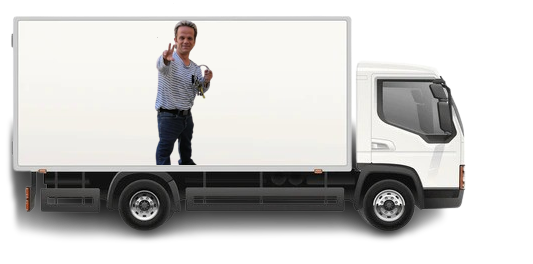

# TRANSPORTE PAS PARTOUT



## COUCOU

coucou les amis ici jamie voici comment lancer le projets :D

#### en 1er :
tu prend node et tu l'install en deux deux 

#### en 2eme :
tu prend le projet comme ça :
```bash
git clone https://github.com/M1n-0/TransportePasPartout.git
```

#### en 3eme :
tu install le reste plus vite que ça :
```bash
npm install express body-parser serialport
```

#### en 4eme :
puis tu me lances tout ça là :
```bash
node app.js
```